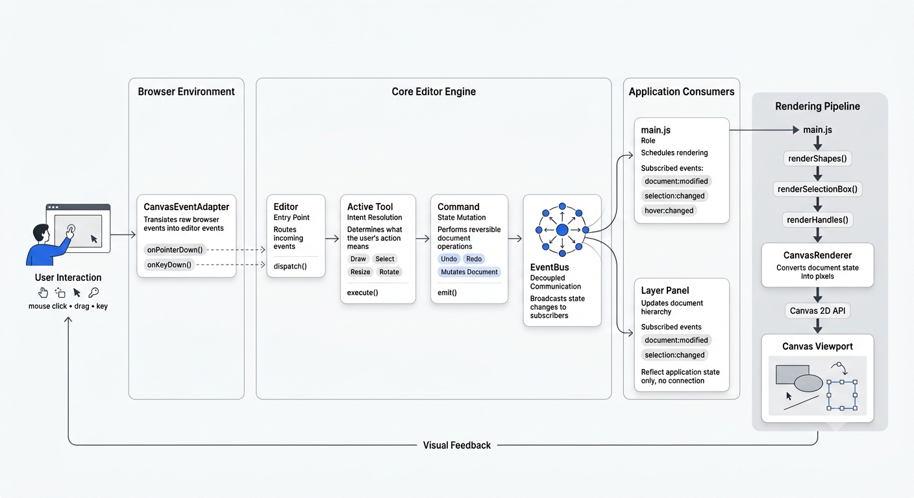

# Canvas Graphics Editor

A browser-based graphics editor powered by a **framework-agnostic editor engine** built entirely in TypeScript.

The project explores how modern graphics editors can be architected using a retained-mode document model, command-based editing, and event-driven communication while remaining independent of any rendering technology or UI framework.

## Demo

<video src="https://github.com/user-attachments/assets/85fe9ee0-bc91-4890-a1a2-6dfbdf6c937a" controls autoplay loop muted></video>

## Editor Engine

The editor is built around a reusable engine that manages editing logic separately from rendering and user interface concerns.

Core architectural concepts include:

- Retained-mode scene graph
- Ports & Adapters architecture
- Command Pattern
- State machine–driven tools
- Event-driven communication
- Framework-independent core
- Pluggable rendering adapters

The HTML5 Canvas implementation is just one adapter—the core engine can be reused with different rendering technologies or UI frameworks.

For a detailed overview of the engine architecture, see [`editor-engine/README.md`](editor-engine/README.md).

## Architecture

## App types

### Vanilla JavaScript

Raw engine integration with no framework. Direct HTML5 Canvas adapter, no build step, no dependencies.

Open [`public/vanilla-app/README.md`](public/vanilla-app/README.md) for the vanilla app.

### Next.js

Production-grade React app on the same engine. Real-time collaboration via Socket.IO, auth, and persistent storage.

Open [`app/README.md`](app/README.md) for the full-stack app.

## Packages

- [`editor-engine/`](editor-engine/) - Core TypeScript editor engine
- [`public/vanilla-app/`](public/vanilla-app/) - Vanilla JavaScript example
- [`app/`](app/) - Next.js frontend
- [`server/`](server/) - Express backend
